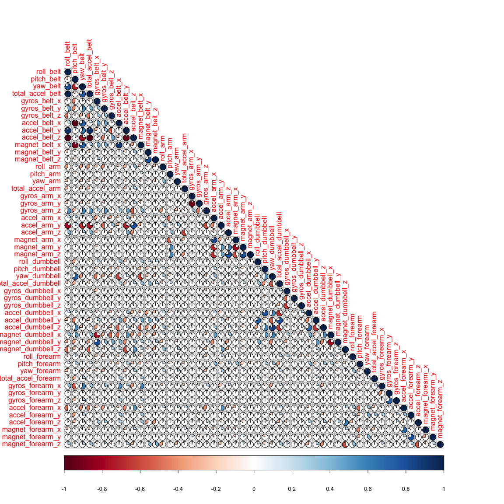
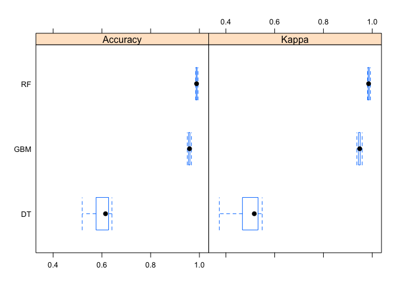
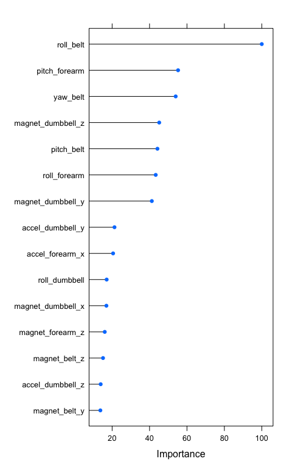

# Human Activity Recognition
Benjamin Rouillé d'Orfeuil  
October 13, 2016  


## Overview
This project aims at predicting the manner in which a weight lifting exercise was performed. The data come from the accelerometers on the belt, forearm, arm, and dumbell of 6 participants who were asked to perform one set of 10 repetitions of the Unilateral Dumbbell Biceps Curl in different fashions. According to the documentation available [here](http://groupware.les.inf.puc-rio.br/har#ixzz4N0qkUPtC), the quality of the execution of the exercise is divided in 5 classes that are listed below:

* Class A: exactly according to the specification;
* Class B: throwing the elbows to the front;
* Class C: lifting the dumbbell only halfway;
* Class D: lowering the dumbbell only halfway;
* Class D: throwing the hips to the front.

In order to come up with the best prediction model, we will go through the following steps. We first read and clean the data. We then divide the training data set into a training and validation data set. We use a k-fold cross-validation to tune and evaluate three sophisticated machine learning models: classification tree, random forest and stochastic gradient boosting. The best model is selected and its out of sample error is estimated. We finally apply the model to the original testing data set.


## Loading and Reading the Data
Let's load and read the training and test data set:

```r
trainingFileName <- "pml-training.csv"
if( !file.exists(trainingFileName) ) {
    trainingFileURL <- "https://d396qusza40orc.cloudfront.net/predmachlearn/pml-training.csv"
    download.file(trainingFileURL, trainingFileName, method = "curl")
}

testingFileName <- "pml-testing.csv"
if( !file.exists(testingFileName) ) {
    trainingFileURL <- "https://d396qusza40orc.cloudfront.net/predmachlearn/pml-testing.csv"
    download.file(testingFileURL, testingFileName, method = "curl")
}

training <- read.csv(trainingFileName, header = TRUE)
testing <- read.csv(testingFileName, header = TRUE)
```
The training data set contains 19622 observations of 160 variables. The test data set encloses 20 observations of the same variables.


## Cleaning the Data
We first remove the identification and time variables from both data frames. Those are not related to the **classe** that we want to predict.

```r
training <- training[,-(1:7)]
testing <- testing[,-(1:7)]
```
Let's take a look at variables with NA values in the testing data set.

```r
NAs <- sapply(testing, function(x) mean(is.na(x) ) )
length(which(NAs > 0) ) 
```

```
## [1] 100
```

```r
min(NAs[NAs > 0])
```

```
## [1] 1
```
There are 100 variables enclosing NA values. Besides, one can sees that the NA values represent 100% of the observations. We cannot impute the missing values and thus discard all 100 variables in both data set.

```r
training <- training[,NAs == 0]
testing <- testing[,NAs == 0]
```
We need to make sure that the training data set does not have other variables with NA values.

```r
sum(complete.cases(training) ) == dim(training)[1]
```

```
## [1] TRUE
```
There are no NA values left in the training data set.


## Partioning the Training Data
The training data set is now made of 19622 observations of 53 variables. We want to partition this data set in a training (60% of the original data) and validation (remaining 40%) data set.

```r
library("caret")
inTrain <- createDataPartition(training$class, p = 0.6, list = FALSE)
trainingSample <- training[inTrain,]
validationSample <- training[-inTrain,]
```
The training sample will be used to tune and compare the models considered in this project while the validation sample will allow to estimate the out of sample error of the best model.

## Modeling
A classification tree, random forest and stochastic gradient boosting model are used to predict the manner in which the participants did the exercise (**classe** variable). We will use all 52 predictors to do so. For the training scheme, we will use a 5-fold cross-validation. We repeat the procedure 4 times in order to compare the accuracy distributions (20 values) between the models.

```r
control <- trainControl(method = "repeatedcv", number = 5, repeats = 4)
```
We now train the three models.

```r
set.seed(64)

model_dt  <- train(classe ~ ., method = 'rpart', trControl = control, data = trainingSample)
model_rf  <- train(classe ~ ., method = 'rf', trControl = control, data = trainingSample, ntree = 200)
model_gbm <- train(classe ~ ., method = 'gbm', trControl = control, data = trainingSample, verbose = FALSE)
```

The accuracy distribution for each model is summarized below in terms of percentiles:

```r
results <- resamples(list(DT = model_dt, RF = model_rf, GBM = model_gbm, RF = model_rf) )
summary(results)
```

```
## 
## Call:
## summary.resamples(object = results)
## 
## Models: DT, RF, GBM, RF 
## Number of resamples: 20 
## 
## Accuracy 
##       Min. 1st Qu. Median   Mean 3rd Qu.   Max. NA's
## RF  0.9847  0.9868 0.9883 0.9888  0.9903 0.9945    0
## DT  0.5193  0.5815 0.6149 0.5986  0.6270 0.6412    0
## GBM 0.9503  0.9554 0.9594 0.9585  0.9610 0.9673    0
## 
## Kappa 
##       Min. 1st Qu. Median   Mean 3rd Qu.   Max. NA's
## RF  0.9807  0.9833 0.9852 0.9858  0.9878 0.9930    0
## DT  0.3729  0.4747 0.5164 0.4903  0.5313 0.5486    0
## GBM 0.9371  0.9436 0.9487 0.9475  0.9507 0.9586    0
```
One can sees that the random forest is the model that performs the best. We will now use this model.


## Validation
Using the validation data sample, we extract the confusion matrix of the random forest model.

```r
predict_validation <- predict(model_rf, newdata = validationSample)
confusionMatrix(predict_validation, validationSample$classe)
```

```
## Confusion Matrix and Statistics
## 
##           Reference
## Prediction    A    B    C    D    E
##          A 2229    4    0    0    0
##          B    2 1514    2    0    0
##          C    0    0 1365   10    1
##          D    1    0    1 1276    4
##          E    0    0    0    0 1437
## 
## Overall Statistics
##                                           
##                Accuracy : 0.9968          
##                  95% CI : (0.9953, 0.9979)
##     No Information Rate : 0.2845          
##     P-Value [Acc > NIR] : < 2.2e-16       
##                                           
##                   Kappa : 0.996           
##  Mcnemar's Test P-Value : NA              
## 
## Statistics by Class:
## 
##                      Class: A Class: B Class: C Class: D Class: E
## Sensitivity            0.9987   0.9974   0.9978   0.9922   0.9965
## Specificity            0.9993   0.9994   0.9983   0.9991   1.0000
## Pos Pred Value         0.9982   0.9974   0.9920   0.9953   1.0000
## Neg Pred Value         0.9995   0.9994   0.9995   0.9985   0.9992
## Prevalence             0.2845   0.1935   0.1744   0.1639   0.1838
## Detection Rate         0.2841   0.1930   0.1740   0.1626   0.1832
## Detection Prevalence   0.2846   0.1935   0.1754   0.1634   0.1832
## Balanced Accuracy      0.9990   0.9984   0.9981   0.9957   0.9983
```
The out of sample error of the random forest model is 0.32%.


## Predicting the Test Set
We apply the random forest model to the test data and print out the result.

```r
predict_testing <- predict(model_rf, newdata = testing)
predict_testing
```

```
##  [1] B A B A A E D B A A B C B A E E A B B B
## Levels: A B C D E
```


### Appendix
* Correlation Matrix

```r
library("corrplot")
M <- cor(trainingSample[,-dim(trainingSample)[2]])
corrplot(M, method = 'pie', type = 'lower')
```

<!-- -->

We observe very little correlations between predictors. For this reason we don't perform any pre-processing, such as a principal component Analysis (PCA), to reduce the number of predictors based on their correlation.

* Accuracy of the Models

```r
bwplot(results)
```

<!-- -->

* Variables of Importance for the Random Forest Model

```r
plot(varImp(model_rf), top = 15)
```

<!-- -->
