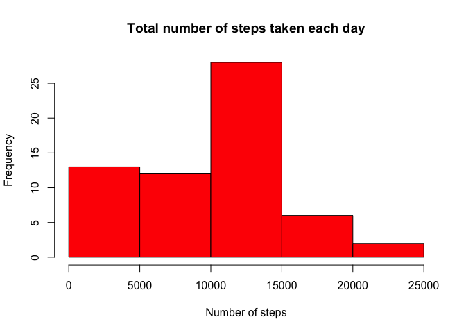
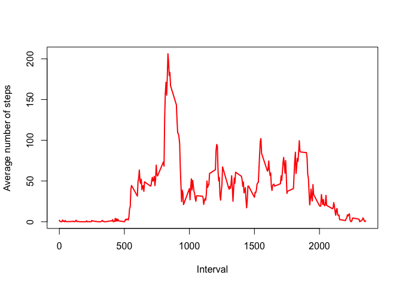
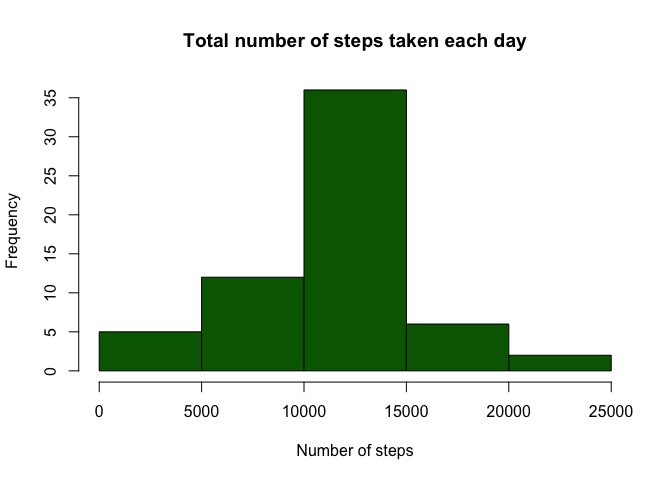
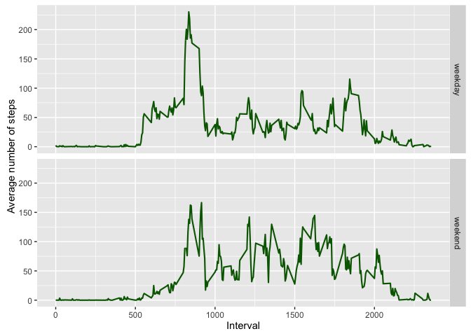

# Reproducible Research: Assignment 1


## Loading and preprocessing the data

```r
fileName <- "activity.csv"
if( !file.exists(fileName) ) unzip("activity.zip")
activity <- read.csv(fileName, header = TRUE)
activity$date <- as.Date(activity$date, "%Y-%m-%d")
activity$interval <- as.factor(activity$interval)
```


## What is the mean total number of steps taken per day?
Let's calculate the total number of steps taken each day. Missing values are removed. The histogram of this variable is shown below in red.

```r
steps.total24h <- with(activity, tapply(steps, date, sum, na.rm = TRUE) )
hist(steps.total24h, xlab = "Number of steps", main = "Total number of steps taken each day", col = "red")
```

<!-- -->

The mean and median of the total of number of steps taken per day are 9354.23 and 10395, respectively.


## What is the average daily activity pattern?
We now calculate the average number of steps taken in each 5-minute interval across all days. The time serie is plotted below in red.

```r
steps.average5min <- with(activity, tapply(steps, interval, mean, na.rm = TRUE) )
with(activity, plot(levels(interval), steps.average5min, type = "l", lwd = 2, 
                    xlab = "Interval", ylab = "Average number of steps", col = "red") )
```

<!-- -->

The maximum number of steps occurs in interval indice 104, which corresponds to 5-minute interval 835. In this interval, the average number of steps taken is 206.17.


## Imputing missing values
There are 2304 missing values in the data set. Those can easily be filled in using a simple procedure. To do so, we first identify the observations for which the number of steps is missing and then use the daily averaged number of steps taken in the associated 5-minute intervals to impute the missing values.

```r
activity_clean <- activity
for(i in 1:nrow(activity) )
    if(is.na(activity$steps[i]) ) activity_clean$steps[i] <- steps.average5min[activity_clean$interval[i]]
```
The histogram of the total number of steps taken each day is shown below in green. The data set with the imputed missing values has been used.

```r
steps_clean.total24h <- with(activity_clean, tapply(steps, date, sum) )
hist(steps_clean.total24h, col = "dark green", xlab = "Number of steps", 
     main = "Total number of steps taken each day")
```

<!-- -->

The mean and median of the total of number of steps taken per day are 10766.19 and 10766.19, respectively. These values differ from the ones previously obtained.

Missing values were ignored in the first part of this assignment. As a result, days with a significant amount of missing values will have a low total number of steps and consequently will populate the lowest bin of the red histogram. To illustrate, 8 days over the 61 considered in this analysis have a total number of steps equal to 0 since all the intervals in that days have missing values. This is shown below.

```r
print(steps.total24h)
```

```
## 2012-10-01 2012-10-02 2012-10-03 2012-10-04 2012-10-05 2012-10-06 
##          0        126      11352      12116      13294      15420 
## 2012-10-07 2012-10-08 2012-10-09 2012-10-10 2012-10-11 2012-10-12 
##      11015          0      12811       9900      10304      17382 
## 2012-10-13 2012-10-14 2012-10-15 2012-10-16 2012-10-17 2012-10-18 
##      12426      15098      10139      15084      13452      10056 
## 2012-10-19 2012-10-20 2012-10-21 2012-10-22 2012-10-23 2012-10-24 
##      11829      10395       8821      13460       8918       8355 
## 2012-10-25 2012-10-26 2012-10-27 2012-10-28 2012-10-29 2012-10-30 
##       2492       6778      10119      11458       5018       9819 
## 2012-10-31 2012-11-01 2012-11-02 2012-11-03 2012-11-04 2012-11-05 
##      15414          0      10600      10571          0      10439 
## 2012-11-06 2012-11-07 2012-11-08 2012-11-09 2012-11-10 2012-11-11 
##       8334      12883       3219          0          0      12608 
## 2012-11-12 2012-11-13 2012-11-14 2012-11-15 2012-11-16 2012-11-17 
##      10765       7336          0         41       5441      14339 
## 2012-11-18 2012-11-19 2012-11-20 2012-11-21 2012-11-22 2012-11-23 
##      15110       8841       4472      12787      20427      21194 
## 2012-11-24 2012-11-25 2012-11-26 2012-11-27 2012-11-28 2012-11-29 
##      14478      11834      11162      13646      10183       7047 
## 2012-11-30 
##          0
```

Now that we have imputed the missing values with the daily averaged number of steps taken in a 5-minute interval, the green histogram appears less skewed. Days with a significant fraction of missing values now populate the central bin. Consequently, the mean and the average have increased.


## Are there differences in activity patterns between weekdays and weekends?
We will use the data set with filled-in missing values. We first create a new observable in the data set to identify whether an observation was taken during a weekday or weekend day.

```r
days <- weekdays(activity_clean$date)
activity_clean$daytype <- "weekday"
activity_clean$daytype[days == "Saturday" | days == "Sunday"] <- "weekend"
activity_clean$daytype <- as.factor(activity_clean$daytype)
```
We can now plot the time series of the 5-minute interval and the average number of steps taken, averaged across all weekday or weekend days.

```r
steps.average5min.daytype <- aggregate(steps ~ interval + daytype, activity_clean, mean)
ggplot(steps.average5min.daytype, aes(x = rep(as.numeric(levels(interval) ), 2), y = steps) ) + 
    geom_line(col = "dark green", size = 0.75) + 
    facet_grid(daytype ~ .) + 
    labs(x = "Interval", y = "Average number of steps")
```

<!-- -->

The two time series exhibit differences in activity pattern between weekdays and weekends.
